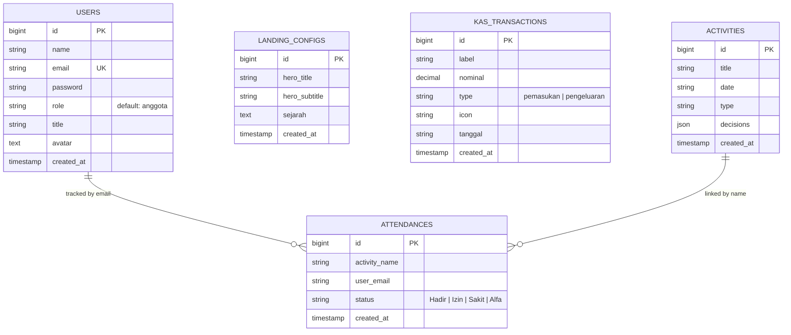

# formula 🧪✨

Formula is a premium, modern, and state-of-the-art web application designed for youth and community organization management. It empowers the **FORMULA (Forum Pemuda Pemudi Ngampon)** organization to streamline communications, manage finances, orchestrate community activities, track attendances, and dynamically manage landing page contents.

---

## 🛠️ Technology Stack

- **Frontend**: Vue.js (Vite, Vue Router, Pinia) with a customized modern glassmorphic responsive design.
- **Backend**: Laravel API (Eloquent ORM, Session-based State, RESTful JSON responses).
- **Database**: SQLite / MySQL / PostgreSQL (fully supported via Laravel Migrations).

---

## 💾 Database Schema & Structure

The system uses a robust database structure designed to be clean, relational, and high-performance.

### 1. `users` Table
Stores registered organization members, their roles, titles, and profile avatars.
| Column | Type | Nullable | Default | Description |
| :--- | :--- | :--- | :--- | :--- |
| `id` | `bigint` (PK) | No | - | Auto-increment unique identifier. |
| `name` | `string` | No | - | Full name of the user/member. |
| `email` | `string` | No | - | Unique email address used for authentication. |
| `password` | `string` | No | - | Hashed password for security. |
| `role` | `string` | No | `'anggota'` | Role of the user (e.g., `'admin'`, `'anggota'`). |
| `title` | `string` | Yes | `NULL` | Organization title/position (e.g., `'Ketua'`, `'Sekretaris'`). |
| `avatar` | `text` | Yes | `NULL` | Profile picture URI or Base64 data representation. |
| `created_at` / `updated_at` | `timestamps` | No | - | Record creation and modification timestamps. |

### 2. `landing_configs` Table
Enables dynamic administration and editing of the landing page's main hero section and history.
| Column | Type | Nullable | Default | Description |
| :--- | :--- | :--- | :--- | :--- |
| `id` | `bigint` (PK) | No | - | Unique identifier. |
| `hero_title` | `string` | No | - | Headline of the landing page hero section. |
| `hero_subtitle` | `string` | No | - | Subtitle/description of the hero section. |
| `sejarah` | `text` | No | - | Complete historical narrative of the FORMULA organization. |
| `created_at` / `updated_at` | `timestamps` | No | - | Record timestamps. |

### 3. `kas_transactions` Table
Tracks income and expenses for real-time financial reporting.
| Column | Type | Nullable | Default | Description |
| :--- | :--- | :--- | :--- | :--- |
| `id` | `bigint` (PK) | No | - | Unique identifier. |
| `label` | `string` | No | - | Description of the transaction (e.g., `'Iuran Bulanan Mei'`). |
| `nominal` | `decimal(15,2)` | No | - | Amount of money in the transaction. |
| `type` | `string` | No | - | `'pemasukan'` (income) or `'pengeluaran'` (expense). |
| `icon` | `string` | No | - | Visual icon identifier representing the category. |
| `tanggal` | `string` | No | - | Date of transaction in string format. |
| `created_at` / `updated_at` | `timestamps` | No | - | Record timestamps. |

### 4. `activities` Table
Contains scheduled youth organization activities, meetings, or social events.
| Column | Type | Nullable | Default | Description |
| :--- | :--- | :--- | :--- | :--- |
| `id` | `bigint` (PK) | No | - | Unique identifier. |
| `title` | `string` | No | - | Title/Name of the activity. |
| `date` | `string` | No | - | Date of the scheduled activity. |
| `type` | `string` | No | - | Category/Type of activity (e.g., `'Rapat'`, `'Bakso'`). |
| `decisions` | `json` | Yes | `NULL` | JSON array containing minutes of meeting, decisions, or results. |
| `created_at` / `updated_at` | `timestamps` | No | - | Record timestamps. |

### 5. `attendances` Table
Manages the attendance of members for specific activities.
| Column | Type | Nullable | Default | Description |
| :--- | :--- | :--- | :--- | :--- |
| `id` | `bigint` (PK) | No | - | Unique identifier. |
| `activity_name` | `string` | No | - | Linked name of the activity. |
| `user_email` | `string` | No | - | Linked email of the attending user. |
| `status` | `string` | No | - | Attendance status (e.g., `'Hadir'`, `'Izin'`, `'Sakit'`, `'Alfa'`). |
| `created_at` / `updated_at` | `timestamps` | No | - | Record timestamps. |

---

## ⚡ Backend Functions & APIs

The backend leverages clean controllers following SOLID principles, returning RESTful JSON responses.

### 🔑 1. Authentication & Session Management (`AuthController`)
Handles secure authentication without exposing state unnecessarily.
- **Login** (`POST /api/login`): Validates user credentials, regenerates session tokens to prevent session fixation, and returns authenticated user details.
- **Logout** (`POST /api/logout`): Logs out the user, invalidates the active session, and regenerates CSRF tokens.
- **Session Check** (`GET /api/session`): Checks if the user is authenticated and returns their current state.

### 👥 2. Member & User Management (`MemberController`)
Provides complete CRUD functionalities for administrators to manage organization members.
- **List Members** (`GET /api/members`): Fetches all users ordered by newest first.
- **Register Member** (`POST /api/members`): Validates inputs, hashes password using `bcrypt`, and registers a new member.
- **Update Member** (`PUT /api/members/{id}`): Safely updates member details and updates password if provided.
- **Delete Member** (`DELETE /api/members/{id}`): Deletes user records from the system.

### 💰 3. Financial Management Ledger (`KasController`)
Manages cash flow and provides instant calculations of income, expenses, and net balance.
- **Get Ledger Statement** (`GET /api/kas`): Automatically calculates total `pemasukan`, total `pengeluaran`, net `saldo` (balance), and fetches the chronological transaction ledger.
- **Post Transaction** (`POST /api/kas`): Creates an income or expense transaction entry.
- **Delete Transaction** (`DELETE /api/kas/{id}`): Deletes a ledger entry.

### 📅 4. Activity & Agenda Management (`ActivityController`)
Handles the organization's agenda and logs meeting decisions/results.
- **List Activities** (`GET /api/activities`): Retrieves all scheduled events and activities.
- **Create Activity** (`POST /api/activities`): Logs a new activity with title, date, category, and meeting results in JSON format.
- **Delete Activity** (`DELETE /api/activities/{id}`): Removes an activity from the schedule.

### 📝 5. Attendance Tracker (`AttendanceController`)
Facilitates bulk tracking of attendances for every registered event.
- **View Attendance** (`GET /api/attendance/{activityName}`): Returns a map of user emails and their respective attendance status for a given activity.
- **Save Attendance** (`POST /api/attendance/{activityName}`): Performs bulk `updateOrCreate` on attendance statuses for a given array of member emails.

### 🌐 6. Landing Page Configurator (`LandingController`)
Allows admins to update the public facing landing page contents dynamically.
- **Fetch Landing Info** (`GET /api/landing`): Fetches landing configuration. If none exist, it automatically populates default seeds.
- **Update Landing Info** (`PUT /api/landing`): Updates hero title, description, and historical overview.
