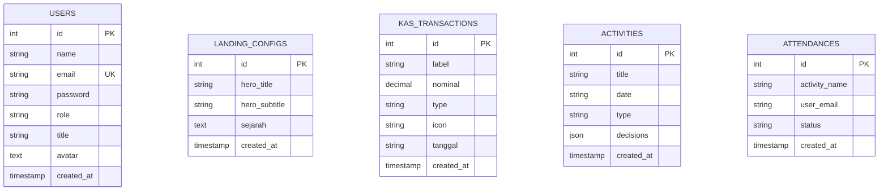

# Peta Jalan Integrasi Backend Laravel & Database MySQL Laragon

Dokumen ini memandu Anda untuk menjalankan, mengonfigurasi, dan mengintegrasikan **Backend Laravel 13** dengan basis data **MySQL lokal Laragon** untuk mendukung seluruh fitur dinamis aplikasi FORMULA.

---

## 🛠️ Langkah Persiapan & Pembuatan Database MySQL di Laragon

Laragon mendukung MySQL secara default. Ikuti langkah sederhana berikut untuk menyiapkan database lokal:

1. **Jalankan Laragon** dan klik tombol **"Start All"** untuk mengaktifkan server Apache & MySQL.
2. Klik tombol **"Database"** pada panel Laragon (atau buka alat pengelola database Anda seperti HeidiSQL/phpMyAdmin).
3. Buat database baru bernama **`formula`**:
   * Klik kanan pada koneksi sesi lokal > **Create new** > **Database**.
   * Beri nama database: **`formula`**
   * Klik **OK**.
4. Konfigurasi file `.env` di folder `backend` sudah disiapkan secara otomatis sebagai berikut:
   ```env
   DB_CONNECTION=mysql
   DB_HOST=127.0.0.1
   DB_PORT=3306
   DB_DATABASE=formula
   DB_USERNAME=root
   DB_PASSWORD=
   ```

---

## 🚀 Perintah Migrasi & Pengisian Data Awal (Seeding)

Jalankan perintah berikut di terminal pada folder `backend` untuk memigrasi tabel dan mengisi data awal sistem:

```bash
php artisan migrate:fresh --seed
```

### 👤 Akun Default yang Berhasil Dibuat:
* **Admin (Fandi Ahmad):**
  * Email: `admin@formula.org`
  * Password: `admin123`
* **Anggota I (Aditya Pratama):**
  * Email: `adit@formula.org`
  * Password: `member123`
* **Anggota II (Rina Amalia):**
  * Email: `rina@formula.org`
  * Password: `member123`

---

## 🗄️ Skema Tabel Database yang Dirancang

Berikut adalah visualisasi hubungan tabel database yang dibuat:



---

## 🔌 Daftar Endpoint API yang Tersedia (`/api`)

Seluruh endpoint API telah terdaftar dengan rapi di dalam file [`web.php`](file:///c:/laragon/www/formula/backend/routes/web.php):

| Metode | Endpoint | Fungsi | Penerima Parameter |
| :--- | :--- | :--- | :--- |
| **POST** | `/api/login` | Otentikasi masuk pengguna | `email`, `password` |
| **POST** | `/api/logout` | Keluar dari sesi | - |
| **GET** | `/api/session` | Memeriksa sesi aktif | - |
| **GET** | `/api/landing` | Mengambil teks landing page | - |
| **POST** | `/api/landing` | Mengubah teks landing page | `hero_title`, `hero_subtitle`, `sejarah` |
| **GET** | `/api/kas` | Mengambil data kas & riwayat | - |
| **POST** | `/api/kas` | Menambahkan kas baru | `label`, `nominal`, `type`, `icon`, `tanggal` |
| **DELETE**| `/api/kas/{id}` | Menghapus riwayat kas | - |
| **GET** | `/api/activities` | Mengambil daftar rapat/agenda | - |
| **POST** | `/api/activities`| Menambahkan rapat/agenda baru | `title`, `date`, `type`, `decisions` |
| **DELETE**| `/api/activities/{id}`| Menghapus rapat/agenda | - |
| **GET** | `/api/attendance/{activity}`| Mengambil presensi kegiatan | - |
| **POST** | `/api/attendance/{activity}`| Menyimpan presensi kegiatan | `attendance` (array email => status) |
| **GET** | `/api/members` | Mengambil daftar pengurus | - |
| **POST** | `/api/members` | Menambahkan pengurus baru | `name`, `email`, `password`, `role`, `title`, `avatar` |
| **PUT** | `/api/members/{id}` | Mengubah data pengurus | `name`, `email`, `role`, `title`, `avatar` |
| **DELETE**| `/api/members/{id}` | Menghapus pengurus | - |

---

## 🔄 Arah Perubahan Cara Input & Aliran Data Frontend (Pinia)

Untuk menghubungkan antarmuka frontend dengan backend Laravel dinamis, perbarui file `src/stores/social.js` Anda untuk melakukan panggilan fetch/axios ke port server backend (default `http://localhost:8000`).

### Contoh Integrasi Pembacaan Kas Dinamis:
```javascript
async fetchKasData() {
  const response = await fetch('http://localhost:8000/api/kas')
  const data = await response.json()
  this.kasData.pemasukan = data.pemasukan
  this.kasData.pengeluaran = data.pengeluaran
  this.kasData.saldo = data.saldo
  this.kasData.riwayat = data.riwayat
}
```

### Contoh Integrasi Input Transaksi Kas Dinamis:
```javascript
async addTransaction(payload) {
  const response = await fetch('http://localhost:8000/api/kas', {
    method: 'POST',
    headers: { 'Content-Type': 'application/json' },
    body: JSON.stringify(payload)
  })
  if (response.ok) {
    await this.fetchKasData()
  }
}
```
