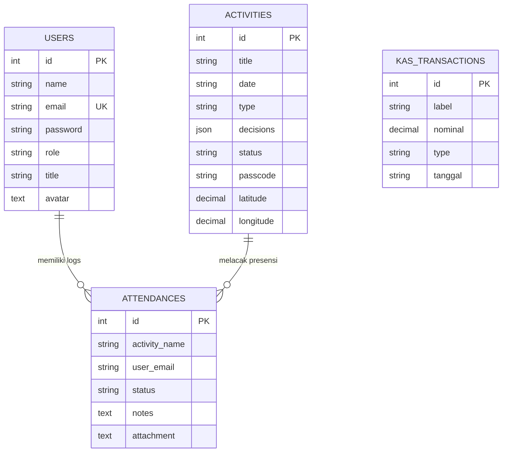

# Analisis & Skema Database (FORMULA) 🧪🗄️

Dokumen ini merangkum rancangan tabel, relasi, tipe data, dan blueprint migrasi basis data MySQL yang digunakan untuk menyokong aplikasi FORMULA.

---

## 🛠️ Konfigurasi Koneksi (`.env`)
Database dihosting secara lokal menggunakan MySQL bawaan **Laragon**:
```env
DB_CONNECTION=mysql
DB_HOST=127.0.0.1
DB_PORT=3306
DB_DATABASE=formula
DB_USERNAME=root
DB_PASSWORD=
```

---

## 🗄️ Struktur Tabel Database

### 1. Tabel `users`
Menyimpan akun kredensial dan peran (role) dari pengurus dan anggota.
* **Kolom**:
  * `id` (bigint, PK, Auto-increment)
  * `name` (string)
  * `email` (string, Unique)
  * `password` (string, Bcrypt hash)
  * `role` (string) - `'admin'` atau `'anggota'`
  * `title` (string) - Jabatan (cth: `'Ketua Umum'`, `'Sekretaris'`)
  * `avatar` (text, Nullable) - Tautan gambar profil
  * `remember_token` (string, Nullable)
  * `created_at` & `updated_at` (timestamps)

### 2. Tabel `landing_configs`
Menyimpan data teks statis bawaan untuk kompatibilitas legacy.
* **Kolom**:
  * `id` (bigint, PK)
  * `hero_title` (string)
  * `hero_subtitle` (string)
  * `sejarah` (text)

### 3. Tabel `landing_sections`
Menyusun layout dinamis dan konten seksi landing page (Zero-Code CMS).
* **Kolom**:
  * `id` (bigint, PK)
  * `key` (string, Unique) - `'hero'`, `'about'`, `'kas'`, `'gallery'`, `'faq'`
  * `title` (string)
  * `subtitle` (string, Nullable)
  * `order_index` (integer) - Menentukan urutan rendering seksi
  * `is_active` (boolean)
  * `content` (json, Nullable) - Data teks/konten dinamis seksi
  * `style_configs` (json, Nullable) - Gaya visual (warna latar, padding)

### 4. Tabel `landing_settings`
Menyimpan nilai konfigurasi global seperti nama brand, logo, dan variabel CSS tema.
* **Kolom**:
  * `id` (bigint, PK)
  * `key` (string, Unique) - `'brand_name'`, `'logo_url'`, `'primary_color'`
  * `value` (text, Nullable)
  * `group` (string) - `'general'`, `'theme'`, `'seo'`
  * `description` (text, Nullable)

### 5. Tabel `landing_navbars` & `landing_features`
Mengontrol menu navigasi dan baris ikon keunggulan secara dinamis.
* **Kolom Navbars**: `id`, `label`, `url_path`, `order_index`, `is_active`
* **Kolom Features**: `id`, `title`, `description`, `icon`, `order_index`, `is_active`

### 6. Tabel `testimonials` & `gallery_items` & `faqs` & `social_links`
* **Testimonials**: `id`, `name`, `role`, `avatar`, `content`, `rating`, `is_featured`
* **Gallery Items**: `id`, `title`, `description`, `image_url`, `category`, `event_date`
* **Faqs**: `id`, `question`, `answer`, `order_index`
* **Social Links**: `id`, `platform`, `url`, `is_active`

### 7. Tabel `activities` & `attendances`
Mengelola sesi rapat/agenda dan log kehadiran anggota.
* **Kolom `activities`**:
  * `id` (bigint, PK)
  * `title` (string)
  * `date` (string)
  * `type` (string) - `'rapat'` atau `'agenda'`
  * `decisions` (json) - List poin keputusan rapat (notulen)
  * `status` (string) - `'scheduled'`, `'active'` (absensi dibuka), `'completed'`
  * `passcode` (string, Nullable) - PIN 4-digit acak untuk presensi mandiri
  * `latitude` / `longitude` (decimal, Nullable) - Koordinat geofencing GPS
* **Kolom `attendances`**:
  * `id` (bigint, PK)
  * `activity_name` (string)
  * `user_email` (string)
  * `status` (string) - `'Hadir'`, `'Izin'`, `'Sakit'`, `'Alfa'`
  * `notes` (text, Nullable) - Alasan tidak hadir mandiri
  * `attachment` (text, Nullable) - Path foto surat dokter/tugas di backend

### 8. Tabel `kas_transactions`
Menyimpan mutasi iuran kas organisasi.
* **Kolom**: `id`, `label`, `nominal` (decimal), `type` (pemasukan/pengeluaran), `tanggal`

---

## 📊 Entity Relationship Diagram (ERD)


