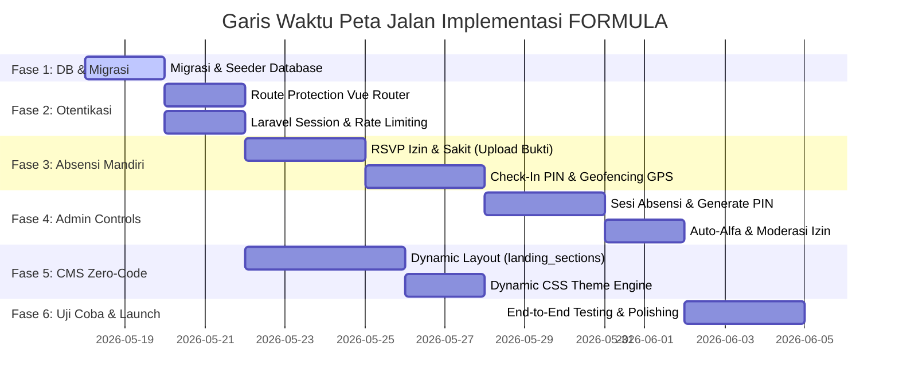

# Peta Jalan Implementasi (Roadmap) 🧪🗺️
### Integrasi CMS Zero-Code, Otentikasi RBAC, dan Absensi Mandiri (Proyek FORMULA)

Peta jalan ini membagi seluruh hasil analisis kebutuhan sebelumnya menjadi **6 Fase Implementasi** yang terstruktur, bertahap, dan mudah dipantau. Dengan mengikuti urutan fase ini, Anda dapat membangun sistem tanpa mengalami konflik kode (*code conflicts*) dan memastikan keamanan sistem tetap terjaga.

---

## 📅 Visualisasi Garis Waktu (Gantt Chart Roadmap)

Berikut adalah urutan pengerjaan logis dari setiap modul sistem:



---

## 🛠️ Detail Rencana Aksi Fase-demi-Fase

---

### 🗄️ FASE 1: Fondasi Database & Migrasi (Backend Laravel)
*Tujuan: Menyiapkan seluruh struktur tabel baru dan menambahkan kolom kontrol di Laravel agar backend siap memproses data.*

- [ ] **1.1. Migrasi Tabel Landing Page CMS & Setting**
  * Salin blueprint di [zero_code_landing_page_cms.md](file:///c:/laragon/www/formula/docs/zero_code_landing_page_cms.md) untuk membuat tabel `landing_sections`, `landing_settings`, `landing_navbars`, dan `landing_features`.
- [ ] **1.2. Migrasi Modifikasi Absensi**
  * Salin blueprint di [member_attendance_system.md](file:///c:/laragon/www/formula/docs/member_attendance_system.md) untuk memodifikasi tabel `activities` dan `attendances`.
- [ ] **1.3. Membuat Database Seeder**
  * Buat `LandingSeeder` untuk mengisi setting awal (warna tema default, logo default, deskripsi SEO) dan layout seksi default (`hero`, `about`, `kas`, dll) agar halaman depan langsung terisi data saat bermigrasi.
- [ ] **1.4. Jalankan Perintah Migrasi**
  ```bash
  php artisan migrate:fresh --seed
  ```

---

### 🔑 FASE 2: Otentikasi & Keamanan Sisi Member (Auth & Security Flow)
*Tujuan: Membangun gerbang masuk yang aman untuk Anggota dan memisahkan hak akses mereka dengan Admin.*

- [ ] **2.1. Konfigurasi Vue Router Navigation Guard**
  * Terapkan pengecekan properti `meta: { requiresAuth: true, role: 'anggota' }` pada file `src/router/index.js` untuk memblokir akses manual URL Admin bagi anggota biasa (dan sebaliknya).
- [ ] **2.2. Implementasi Rate Limiting di Laravel**
  * Aktifkan pencegahan brute-force (maksimal 5x percobaan per menit) di `LoginRequest` atau API route login.
- [ ] **2.3. Pengaturan Session Fixation Protection**
  * Pastikan controller login memanggil `$request->session()->regenerate()` setiap kali kredensial anggota dinyatakan sukses.
- [ ] **2.4. Desain Form Login Premium (Glassmorphism)**
  * Perbarui antarmuka login di frontend Vue dengan efek transparan, micro-animations hover, toggle sembunyikan/tampilkan password, dan status tombol memuat (*loading state spinner*).

---

### 🙋‍♂️ FASE 3: Absensi Mandiri & Dashboard Anggota (Member Area)
*Tujuan: Menyediakan fitur interaktif bagi anggota untuk check-in atau mengajukan izin dari HP mereka.*

- [ ] **3.1. Membuat Halaman Dashboard Anggota**
  * Buat UI dashboard sederhana bergaya glassmorphism khusus anggota dengan ringkasan status keaktifan mereka (persentase kehadiran & status kas).
- [ ] **3.2. Fitur Pengajuan Izin/Sakit Mandiri**
  * Buat formulir pengajuan izin di frontend Vue, dukung penginputan alasan tertulis dan upload bukti foto (surat dokter/tugas).
  * Buat endpoint `POST /api/member/attendance/permit` di Laravel untuk memvalidasi inputan dan menyimpan path file di local storage.
- [ ] **3.3. Fitur Check-In dengan Input PIN & Geofencing GPS**
  * Buat form input box PIN 4-digit dengan transparan visual.
  * Gunakan API Geolocation browser di Vue untuk mendeteksi koordinat GPS HP Anggota secara opsional.
  * Buat endpoint `POST /api/member/attendance/check-in` di Laravel untuk mencocokkan PIN, menghitung jarak GPS, dan menyimpan status "Hadir" di tabel `attendances`.

---

### 👑 FASE 4: Admin Controls & Sesi Absensi (Admin Dashboard)
*Tujuan: Memberikan panel kendali bagi Admin untuk mengatur sesi rapat dan memoderasi data.*

- [ ] **4.1. Panel Kontrol Mulai & Tutup Sesi Absensi**
  * Buat tombol kontrol di Dashboard Rapat Admin untuk memicu status kegiatan menjadi `'active'` dan mengacak PIN 4-digit, serta menampilkan PIN tersebut dalam ukuran besar.
- [ ] **4.2. Otomatisasi Status "Alfa"**
  * Tambahkan fungsi di Laravel ketika admin menutup sesi rapat (`'completed'`), sistem otomatis mencari anggota yang tidak hadir/tidak izin, lalu mengubah statusnya menjadi **"Alfa"** di database.
- [ ] **4.3. Halaman Moderasi Izin Anggota**
  * Buat antarmuka bagi Admin untuk meninjau permintaan izin/sakit anggota, melihat alasan, memeriksa file lampiran surat, dan mengeklik tombol "Setujui" / "Tolak".
- [ ] **4.4. Override Kehadiran Manual**
  * Pastikan Admin memiliki akses manual untuk merubah status absensi anggota kapan pun jika terjadi keadaan khusus (cth: HP anggota mati).

---

### 🎨 FASE 5: CMS Landing Page & Zero-Code Dynamic Engine
*Tujuan: Membangun sistem yang membuat seluruh landing page render secara dinamis dari database.*

- [ ] **5.1. Dynamic Component Mapper di Vue.js**
  * Ubah susunan landing page Vue Anda agar memuat data dari endpoint API `GET /api/landing-info`.
  * Terapkan rendering dinamis menggunakan tag `<component :is="...">` untuk melingkari seksi-seksi aktif sesuai urutan database.
- [ ] **5.2. Dynamic Theme Engine (Inject CSS Variables)**
  * Terapkan pembacaan data style tema (hex warna primer, secondary, intensitas blur) dari database di store Pinia.
  * Suntikkan (*inject*) nilai tersebut langsung ke root DOM HTML (`document.documentElement.style.setProperty`).
- [ ] **5.3. Halaman Editor CMS di Dashboard Admin**
  * Buat panel editor visual di admin dashboard yang membagi tab: Pengaturan Umum (Logo, Nama Brand), Desain (Tema Warna, Blur), Urutan Seksi (Drag & Drop order), dan FAQ Manager.

---

### 🧪 FASE 6: Uji Coba, Perbaikan, & Peluncuran (Launch)
*Tujuan: Memastikan seluruh fitur berjalan tanpa celah keamanan dan siap digunakan warga Ngampon.*

- [ ] **6.1. Pengujian Fungsionalitas End-to-End (E2E)**
  * Lakukan simulasi login anggota, coba check-in menggunakan PIN salah (pastikan ditolak), coba check-in menggunakan GPS jarak jauh (pastikan terblokir), dan coba kirim surat izin.
- [ ] **6.2. Pengujian Security & Hak Akses**
  * Coba tembus paksa URL Admin menggunakan akun Anggota biasa. Pastikan sistem melempar kembali ke dashboard anggota dengan aman.
- [ ] **6.3. Optimasi Responsivitas Ponsel**
  * Karena anggota akan melakukan absensi mayoritas lewat HP, pastikan seluruh tampilan dashboard anggota sangat responsif dan ringan dimuat di browser handphone.
- [ ] **6.4. Go-Live!**
  * Jalankan di server lokal Laragon atau unggah ke hosting, lalu sebarkan link ke pemuda Ngampon untuk digunakan saat rapat rutin berikutnya.

---

> [!IMPORTANT]
> **Strategi Pengerjaan Terbaik:**
> Kerjakanlah **Fase 1 dan Fase 2 terlebih dahulu**. Menyiapkan database dan memastikan otentikasi login pemisahan admin/anggota berjalan aman adalah fondasi paling krusial sebelum Anda mulai mendesain visual absensi dan dinamisasi landing page di fase-fase berikutnya.
