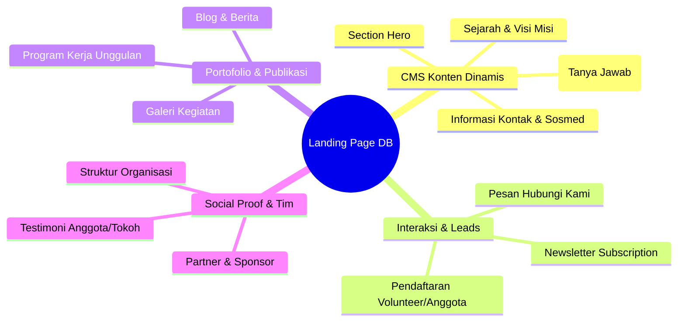
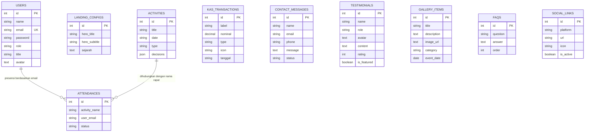

# Analisis Kebutuhan Basis Data Landing Page 🧪✨
### Dinamis, Responsif, dan Terintegrasi Dashboard (FORMULA & General)

Landing page yang modern dan premium tidak hanya berupa halaman HTML statis. Dengan menghubungkan komponen-komponen landing page ke database, Anda dapat membangun **Content Management System (CMS)** mandiri yang memungkinkan admin memperbarui konten langsung dari dashboard tanpa menyentuh kode program.

Dokumen ini menganalisis seluruh elemen landing page yang memungkinkan (dan direkomendasikan) untuk disimpan di database, dilengkapi dengan struktur kolom database, blueprint migrasi Laravel, serta cara integrasi di aplikasi **FORMULA**.

---

## 🗺️ Peta Kebutuhan Elemen Landing Page & Database

Secara umum, kebutuhan database untuk landing page dibagi menjadi **4 Kategori Utama**:



---

## 🗄️ 1. Detail Skema Tabel Database Landing Page

Berikut adalah rancangan detail tabel-tabel baru yang dapat Anda tambahkan ke proyek backend Laravel Anda untuk membuat landing page FORMULA menjadi 100% dinamis.

### A. Tabel `contact_messages` (Pesan Pengunjung)
Menyimpan semua pesan yang dikirim oleh pengunjung melalui formulir "Hubungi Kami".
| Nama Kolom | Tipe Data | Nullable | Keterangan |
| :--- | :--- | :--- | :--- |
| `id` | `bigint` (PK) | No | Auto-increment identifier |
| `name` | `string` | No | Nama lengkap pengirim |
| `email` | `string` | No | Alamat email pengirim |
| `phone` | `string` | Yes | Nomor WhatsApp/Telepon |
| `message` | `text` | No | Isi pesan atau pertanyaan |
| `status` | `string` | No | Default: `'unread'` (Pilihan: `'unread'`, `'read'`, `'replied'`) |
| `ip_address`| `string` | Yes | Untuk mencegah spamming/security tracking |

### B. Tabel `testimonials` (Ulasan & Testimoni)
Menyimpan testimoni dari tokoh masyarakat, sesepuh Ngampon, maupun anggota mengenai dampak positif FORMULA.
| Nama Kolom | Tipe Data | Nullable | Keterangan |
| :--- | :--- | :--- | :--- |
| `id` | `bigint` (PK) | No | Auto-increment identifier |
| `name` | `string` | No | Nama pemberi testimoni |
| `role` | `string` | No | Jabatan/Status (cth: "Ketua RT 02", "Anggota Aktif") |
| `avatar` | `text` | Yes | URL foto atau base64 string gambar profil |
| `content` | `text` | No | Kutipan ulasan / testimoni |
| `rating` | `integer` | No | Default: `5` (Skala rating 1-5 untuk estetika visual bintang) |
| `is_featured`| `boolean` | No | Default: `true` (Menentukan apakah tampil di landing page utama) |

### C. Tabel `gallery_items` (Dokumentasi Kegiatan)
Menyimpan foto-foto kegiatan pemuda/pemudi Ngampon secara dinamis yang akan tampil dalam bentuk grid/carousel premium di frontend.
| Nama Kolom | Tipe Data | Nullable | Keterangan |
| :--- | :--- | :--- | :--- |
| `id` | `bigint` (PK) | No | Auto-increment identifier |
| `title` | `string` | No | Judul kegiatan / foto dokumentasi |
| `description`| `text` | Yes | Deskripsi singkat mengenai momen tersebut |
| `image_url` | `text` | No | Path file gambar di storage backend (`/storage/gallery/...`) |
| `category` | `string` | No | Kategori (cth: "Bakti Sosial", "Olahraga", "Keagamaan") |
| `event_date` | `date` | Yes | Tanggal pelaksanaan kegiatan |

### D. Tabel `faqs` (Pertanyaan yang Sering Diajukan)
Menyimpan daftar FAQ agar pengunjung bisa membaca informasi cepat (misal: "Bagaimana cara bergabung?", "Kapan rapat rutin diadakan?").
| Nama Kolom | Tipe Data | Nullable | Keterangan |
| :--- | :--- | :--- | :--- |
| `id` | `bigint` (PK) | No | Auto-increment identifier |
| `question` | `string` | No | Pertanyaan (cth: "Apakah ada iuran bulanan?") |
| `answer` | `text` | No | Jawaban lengkap |
| `order` | `integer` | No | Default: `0` (Untuk mengatur urutan tampil di accordion list) |

### E. Tabel `social_links` (Media Sosial & Kontak Navigasi)
Mengontrol link eksternal di footer dan header secara dinamis.
| Nama Kolom | Tipe Data | Nullable | Keterangan |
| :--- | :--- | :--- | :--- |
| `id` | `bigint` (PK) | No | Auto-increment identifier |
| `platform` | `string` | No | Nama medsos (cth: `'instagram'`, `'facebook'`, `'youtube'`, `'whatsapp'`) |
| `url` | `string` | No | Tautan lengkap (cth: `https://instagram.com/formula_ngampon`) |
| `icon` | `string` | No | Kelas icon visual (cth: `'ri-instagram-fill'` / FontAwesome) |
| `is_active` | `boolean` | No | Default: `true` (Bisa dinonaktifkan sementara) |

---

## 🛠️ 2. Blueprint Migrasi Laravel (Copy-Paste Ready!)

Anda dapat langsung membuat file-file migrasi ini di folder `backend/database/migrations/` dengan menjalankan command artisan berikut di terminal Anda:

```bash
php artisan make:migration create_landing_page_tables
```

Dan gunakan kode blueprint berikut untuk mengisi migrasinya secara utuh:

```php
<?php

use Illuminate\Database\Migrations\Migration;
use Illuminate\Database\Schema\Blueprint;
use Illuminate\Support\Facades\Schema;

return new class extends Migration
{
    public function up(): void
    {
        // 1. Tabel Pesan Hubungi Kami (Contact Form)
        Schema::create('contact_messages', function (Blueprint $table) {
            $table->id();
            $table->string('name');
            $table->string('email');
            $table->string('phone')->nullable();
            $table->text('message');
            $table->string('status')->default('unread'); // unread, read, replied
            $table->string('ip_address')->nullable();
            $table->timestamps();
        });

        // 2. Tabel Testimoni
        Schema::create('testimonials', function (Blueprint $table) {
            $table->id();
            $table->string('name');
            $table->string('role');
            $table->text('avatar')->nullable();
            $table->text('content');
            $table->integer('rating')->default(5);
            $table->boolean('is_featured')->default(true);
            $table->timestamps();
        });

        // 3. Tabel Galeri Kegiatan
        Schema::create('gallery_items', function (Blueprint $table) {
            $table->id();
            $table->string('title');
            $table->text('description')->nullable();
            $table->text('image_url');
            $table->string('category')->default('Kegiatan');
            $table->date('event_date')->nullable();
            $table->timestamps();
        });

        // 4. Tabel FAQ
        Schema::create('faqs', function (Blueprint $table) {
            $table->id();
            $table->string('question');
            $table->text('answer');
            $table->integer('order')->default(0);
            $table->timestamps();
        });

        // 5. Tabel Social Media Links
        Schema::create('social_links', function (Blueprint $table) {
            $table->id();
            $table->string('platform'); // instagram, facebook, tiktok, etc.
            $table->string('url');
            $table->string('icon'); // ri-instagram-line, ri-facebook-circle-fill
            $table->boolean('is_active')->default(true);
            $table->timestamps();
        });
    }

    public function down(): void
    {
        Schema::dropIfExists('social_links');
        Schema::dropIfExists('faqs');
        Schema::dropIfExists('gallery_items');
        Schema::dropIfExists('testimonials');
        Schema::dropIfExists('contact_messages');
    }
};
```

---

## 📊 3. Entity Relationship Diagram (ERD) Lengkap Proyek FORMULA

Berikut adalah visualisasi bagaimana tabel-tabel baru ini melengkapi skema database FORMULA Anda saat ini:



---

## ⚡ 4. Aliran Integrasi API & Frontend (Vue.js + Laravel)

Berikut adalah panduan singkat cara kerja integrasi data tersebut agar landing page Anda di Frontend Vue.js terasa sangat dinamis dan interaktif.

### 📥 A. Menampilkan Data Dinamis di Landing Page (Read Operations)
Saat pertama kali landing page dimuat, frontend Vue akan memanggil satu API endpoint besar (atau beberapa endpoint paralel) untuk mengambil seluruh konfigurasi:

* **Endpoint**: `GET /api/landing-info`
* **Response JSON**:
  ```json
  {
    "configs": {
      "hero_title": "Membangun Karakter Pemuda Ngampon",
      "hero_subtitle": "Wadah kolaborasi, kreativitas, dan pengabdian masyarakat.",
      "sejarah": "FORMULA didirikan pada tahun..."
    },
    "testimonials": [
      {
        "name": "Pak RT 01",
        "role": "Tokoh Masyarakat",
        "content": "Kehadiran FORMULA sangat membantu kegiatan sosial warga.",
        "rating": 5,
        "avatar": "/storage/avatars/rt1.png"
      }
    ],
    "faqs": [
      {
        "question": "Apakah kegiatan ini khusus pemuda Ngampon?",
        "answer": "Ya, namun kami terbuka untuk kolaborasi lintas desa."
      }
    ],
    "social_links": [
      { "platform": "instagram", "url": "https://instagram.com/..." }
    ]
  }
  ```

### 📤 B. Menyimpan Interaksi Pengunjung (Write Operations)
Saat pengunjung mengisi formulir di landing page (Hubungi Kami), data akan langsung disimpan ke database dengan aman.

* **Endpoint**: `POST /api/contact`
* **Payload Request**:
  ```json
  {
    "name": "Budi Santoso",
    "email": "budi@gmail.com",
    "phone": "08123456789",
    "message": "Halo, saya ingin bertanya tentang syarat mendaftar anggota baru FORMULA."
  }
  ```
* **Aksi Backend Laravel**:
  1. Melakukan validasi input (`required`, `email`, `max:255`).
  2. Menyimpan data ke tabel `contact_messages`.
  3. *(Opsional)* Mengirim notifikasi email ke email admin FORMULA atau notifikasi Telegram bot.
  4. Mengembalikan status sukses `201 Created` ke Frontend Vue.js.

### 🛡️ C. Sistem Dashboard Admin
Semua data di atas dapat dikelola secara penuh (CRUD) melalui modul **Admin Dashboard** yang saat ini sudah Anda rancang di aplikasi FORMULA:
* Admin bisa membalas atau mengubah status pesan masuk (`contact_messages`) menjadi **"Read"** atau **"Replied"**.
* Admin bisa menambah/menghapus foto di **Galeri Kegiatan** (`gallery_items`).
* Admin bisa menambah ulasan/testimoni positif baru agar tampil di depan.

---

> [!TIP]
> **Keuntungan Penyimpanan Database:**
> Dengan menyimpan seluruh elemen ini di database, Anda telah menaikkan kelas aplikasi **FORMULA** menjadi sebuah web aplikasi berstandar industri dengan CMS yang fleksibel. Jika di kemudian hari pemuda Ngampon memiliki akun media sosial baru (seperti TikTok), admin cukup menambahkannya lewat dashboard tanpa harus menulis ulang kode CSS/HTML di Vue.js!
