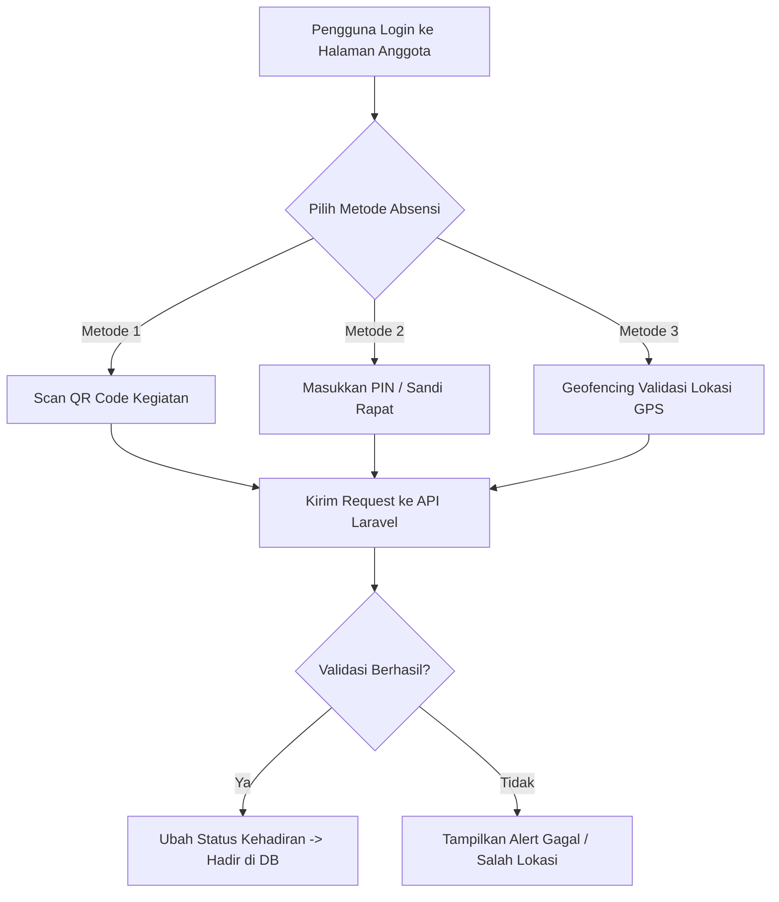
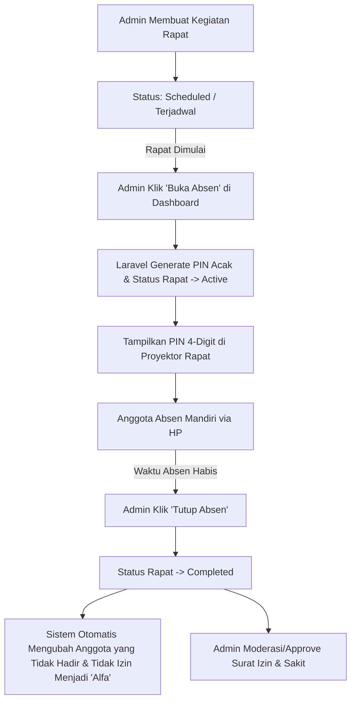

# Analisis & Desain Sistem Absensi Mandiri Anggota 🧪📝
### Integrasi Vue.js + Laravel untuk Presensi Aman, Cepat, dan Modern (FORMULA Absensi)

Dalam sistem organisasi pemuda Ngampon (FORMULA), pencatatan kehadiran yang manual oleh admin seringkali memakan waktu dan kurang efisien. Dengan membangun **Sistem Absensi Mandiri Anggota** yang terintegrasi di dalam halaman login Anggota, anggota dapat melakukan absensi sendiri menggunakan handphone mereka secara instan dan aman.

Dokumen ini menyajikan arsitektur lengkap, modifikasi database, API backend, serta rancangan antarmuka frontend untuk sistem absensi ini.

---

## 🌟 1. Tiga Metode Absensi Mandiri (Kehadiran Fisik)

Untuk memastikan keaslian kehadiran (menghindari titip absen/absen dari rumah), kita merancang **3 opsi metode absensi** yang dapat dipilih sesuai kenyamanan:



### A. Metode 1: Secure Passcode / PIN Rapat (Sangat Direkomendasikan & Mudah)
* **Konsep**: Saat rapat dimulai, Admin/Moderator membuat kode PIN acak 4 digit di layar proyektor (misal: `7942`).
* **Aksi Anggota**: Anggota memasukkan PIN tersebut di dashboard mereka untuk check-in.
* **Keamanan**: PIN bisa diubah oleh admin setiap 10 menit agar tidak bisa disebarkan ke luar ruangan rapat.

### B. Metode 2: Scan QR Code Kegiatan
* **Konsep**: Admin menampilkan QR Code unik kegiatan di layar utama.
* **Aksi Anggota**: Anggota membuka kamera di aplikasi FORMULA (menggunakan library HTML5 QR Scanner di Vue) dan memindai kode tersebut untuk langsung check-in.

### C. Metode 3: Geofencing GPS (Validasi Jarak Lokasi)
* **Konsep**: Aplikasi memeriksa koordinat GPS HP Anggota menggunakan browser Geolocation API.
* **Aksi Anggota**: Mengklik tombol "Absen Sekarang". Sitem akan mencocokkan koordinat HP dengan koordinat lokasi rapat (cth: Balai Desa Ngampon). Jika jaraknya < 50 meter, absensi disetujui.

---

## 🗄️ 2. Peningkatan Skema Database (Database Enhancements)

Untuk mendukung fitur absensi mandiri, pengajuan izin dengan alasan, serta validasi keamanan PIN/GPS, kita perlu menambahkan beberapa kolom pada tabel `activities` dan `attendances`.

### A. Tabel `activities` (Peningkatan)
Kita menambahkan status rapat, passcode, dan lokasi koordinat rapat.
| Nama Kolom | Tipe Data | Default | Keterangan |
| :--- | :--- | :--- | :--- |
| `status` | `string` | `'scheduled'` | Status rapat: `'scheduled'`, `'active'` (bisa diabsen), `'completed'` (absen ditutup) |
| `passcode` | `string` | `NULL` | Kode PIN 4-digit acak untuk absensi mandiri |
| `latitude` | `decimal(10,8)`| `NULL` | Koordinat lintang lokasi rapat (untuk geofencing) |
| `longitude`| `decimal(11,8)`| `NULL` | Koordinat bujur lokasi rapat (untuk geofencing) |

### B. Tabel `attendances` (Peningkatan)
Kita menambahkan kolom alasan izin dan lampiran foto (surat sakit/tugas).
| Nama Kolom | Tipe Data | Default | Keterangan |
| :--- | :--- | :--- | :--- |
| `notes` | `text` | `NULL` | Alasan jika memilih status `'Izin'` atau `'Sakit'` |
| `attachment` | `text` | `NULL` | Path file gambar surat dokter atau bukti pendukung |
| `checked_in_at`| `timestamp`| `NULL` | Waktu persis ketika anggota melakukan klik absensi mandiri |

---

## 🛠️ 3. Blueprint Migrasi Laravel (Modifikasi Tabel)

Buat file migrasi baru di folder `backend/database/migrations/xxxx_xx_xx_add_absensi_columns_to_tables.php`:

```php
<?php

use Illuminate\Database\Migrations\Migration;
use Illuminate\Database\Schema\Blueprint;
use Illuminate\Support\Facades\Schema;

return new class extends Migration
{
    public function up(): void
    {
        // 1. Menambahkan kolom kontrol absensi di tabel activities
        Schema::table('activities', function (Blueprint $table) {
            $table->string('status')->default('scheduled')->after('type'); // scheduled, active, completed
            $table->string('passcode', 6)->nullable()->after('status');
            $table->decimal('latitude', 10, 8)->nullable()->after('passcode');
            $table->decimal('longitude', 11, 8)->nullable()->after('latitude');
        });

        // 2. Menambahkan kolom detail kehadiran di tabel attendances
        Schema::table('attendances', function (Blueprint $table) {
            $table->text('notes')->nullable()->after('status');
            $table->text('attachment')->nullable()->after('notes');
            $table->timestamp('checked_in_at')->nullable()->after('attachment');
        });
    }

    public function down(): void
    {
        Schema::table('attendances', function (Blueprint $table) {
            $table->dropColumn(['notes', 'attachment', 'checked_in_at']);
        });

        Schema::table('activities', function (Blueprint $table) {
            $table->dropColumn(['status', 'passcode', 'latitude', 'longitude']);
        });
    }
};
```

---

## 🔌 4. Endpoint API Backend Laravel (`AttendanceController`)

Berikut adalah rancangan fungsi backend untuk memproses absensi mandiri:

### A. API Check-In Kehadiran (POST `/api/member/attendance/check-in`)
```php
public function checkIn(Request $request)
{
    $request->validate([
        'activity_id' => 'required|exists:activities,id',
        'passcode' => 'required|string',
        // Jika pakai Geofencing
        'latitude' => 'nullable|numeric',
        'longitude' => 'nullable|numeric',
    ]);

    $activity = Activity::findOrFail($request->activity_id);

    // 1. Validasi status kegiatan harus aktif
    if ($activity->status !== 'active') {
        return response()->json(['message' => 'Absensi untuk kegiatan ini belum dibuka atau sudah ditutup.'], 422);
    }

    // 2. Validasi Passcode
    if ($activity->passcode !== $request->passcode) {
        return response()->json(['message' => 'PIN/Sandi absensi salah. Silakan tanyakan ke admin.'], 422);
    }

    // 3. (Opsional) Validasi Geofencing jika koordinat diset
    if ($activity->latitude && $activity->longitude && $request->latitude && $request->longitude) {
        $distance = $this->calculateDistance(
            $activity->latitude, $activity->longitude,
            $request->latitude, $request->longitude
        );

        if ($distance > 50) { // Lebih dari 50 meter
            return response()->json(['message' => 'Anda berada di luar jangkauan lokasi rapat (Jarak Anda: ' . round($distance) . ' meter).'], 422);
        }
    }

    // 4. Update atau Buat data kehadiran
    $attendance = Attendance::updateOrCreate(
        [
            'activity_name' => $activity->title,
            'user_email' => $request->user()->email,
        ],
        [
            'status' => 'Hadir',
            'checked_in_at' => now()
        ]
    );

    return response()->json([
        'message' => 'Absensi berhasil! Kehadiran Anda telah dicatat sebagai Hadir.',
        'data' => $attendance
    ], 200);
}

// Rumus Haversine untuk kalkulasi jarak GPS dalam satuan meter
private function calculateDistance($lat1, $lon1, $lat2, $lon2)
{
    $earthRadius = 6371000; // meter
    $dLat = deg2rad($lat2 - $lat1);
    $dLon = deg2rad($lon2 - $lon1);
    $a = sin($dLat/2) * sin($dLat/2) + cos(deg2rad($lat1)) * cos(deg2rad($lat2)) * sin($dLon/2) * sin($dLon/2);
    $c = 2 * atan2(sqrt($a), sqrt(1-$a));
    return $earthRadius * $c;
}
```

### B. API Pengajuan Izin/Sakit (POST `/api/member/attendance/permit`)
```php
public function submitPermit(Request $request)
{
    $request->validate([
        'activity_id' => 'required|exists:activities,id',
        'status' => 'required|in:Izin,Sakit',
        'notes' => 'required|string|max:500',
        'attachment' => 'nullable|image|max:2048' // maks 2MB
    ]);

    $activity = Activity::findOrFail($request->activity_id);

    $attachmentPath = null;
    if ($request->hasFile('attachment')) {
        $attachmentPath = $request->file('attachment')->store('permits', 'public');
    }

    $attendance = Attendance::updateOrCreate(
        [
            'activity_name' => $activity->title,
            'user_email' => $request->user()->email,
        ],
        [
            'status' => $request->status,
            'notes' => $request->notes,
            'attachment' => $attachmentPath,
            'checked_in_at' => null // tidak checked in secara fisik
        ]
    );

    return response()->json([
        'message' => 'Pengajuan ' . $request->status . ' berhasil dikirim.',
        'data' => $attendance
    ], 200);
}
```

---

## 🖥️ 5. Rancangan Antarmuka Frontend Vue.js (Anggota Panel)

Di halaman dashboard anggota, buat komponen widget absensi modern bergaya *glassmorphism* dengan 2 opsi interaksi utama:

### Tampilan Tab A: Absen Kehadiran (Check-In)
```
+-------------------------------------------------------------+
| 📝 ABSENSI AKTIF: "Rapat Bulanan Karang Taruna Mei"         |
+-------------------------------------------------------------+
| Status Absensi: [ KELAS DIBUKA 🟢 ]                         |
|                                                             |
| Masukkan PIN 4-Digit yang tertera di layar utama:           |
|                                                             |
|       [ 7 ]  [ 9 ]  [ 4 ]  [ 2 ]   <-- Input Box            |
|                                                             |
| 📍 Verifikasi Jarak Lokasi Aktif: Balai Desa Ngampon        |
|    Jarak Anda: 12 meter (Di Dalam Jangkauan ✔️)             |
|                                                             |
| [ >>> SUBMIT KEHADIRAN <<< ] (Button Efek Hover Glass)      |
+-------------------------------------------------------------+
```

### Tampilan Tab B: Ajukan Izin / Berhalangan Hadir
```
+-------------------------------------------------------------+
| 🙋‍♂️ AJUKAN BERHALANGAN HADIR                                 |
+-------------------------------------------------------------+
| Rapat: [ Rapat Bulanan Karang Taruna Mei (20 Mei 2026)    ] |
|                                                             |
| Status Ketidakhadiran:                                      |
| ( ) Izin / Ada Kepentingan     ( ) Sakit                    |
|                                                             |
| Alasan Berhalangan:                                         |
| [ Ada acara keluarga mendadak di luar kota sehingga tidak ] |
| [ bisa menghadiri rapat rutin karang taruna.              ] |
|                                                             |
| Lampiran Surat/Bukti (Opsional):                            |
| [ Pilih File Gambar ] (Mendukung upload foto surat dokter)  |
|                                                             |
| [ Kirim Pengajuan Izin ]                                    |
+-------------------------------------------------------------+
```

---

> [!TIP]
> **Keuntungan Fitur Absensi Mandiri:**
> 1. **Hemat Waktu Rapat**: Anggota tidak perlu diabsen satu per satu secara verbal di awal rapat. Cukup 30 detik untuk semua orang menginput PIN di HP masing-masing.
> 2. **Transparansi Tinggi**: Anggota dapat melihat langsung grafik keaktifan mereka (misalnya: *"Anda hadir 9 dari 10 rapat terakhir"*).
> 3. **Paperless**: Tidak memerlukan berkas fisik surat izin, karena semua surat dokter/bukti izin tersimpan rapi dalam format digital di storage database.

---

## 🛠️ 6. Alur & Kendali Penuh Sisi Administrator (Admin Controls)

Meskipun anggota melakukan absensi secara mandiri melalui HP masing-masing, **kontrol penuh, pembuatan daftar, dan pengaturan absensi tetap berada di tangan Administrator (Admin)**. Anggota tidak dapat melakukan absensi jika Admin belum mengaktifkan sesi rapat tersebut.

Berikut adalah alur kerja dan wewenang penuh Admin dalam sistem absensi:



### A. Tahap 1: Pembuatan Kegiatan & Lokasi Rapat (Setup)
Saat merencanakan rapat/kegiatan baru, Admin membuat agenda di dashboard:
* Mengisi judul rapat, tanggal, dan tipe kegiatan.
* *(Opsional)* Menentukan titik lokasi koordinat (Latitude & Longitude) Balai Desa Ngampon di peta untuk mengaktifkan fitur Geofencing pembatasan jarak GPS.
* Status rapat saat dibuat adalah **`'scheduled'`** (Terjadwal). Di status ini, tombol absensi mandiri di halaman Anggota **belum muncul**.

### B. Tahap 2: Membuka Sesi Absensi & Penayangan PIN (Saat Rapat Dimulai)
Ketika rapat resmi dibuka oleh ketua, Admin membuka Dashboard Admin:
1. Klik tombol **"Mulai Sesi Absensi"** pada agenda tersebut.
2. Backend Laravel akan mengubah status rapat menjadi **`'active'`** dan secara acak men-generate 4-digit PIN (misal: `7942`).
3. Admin menayangkan PIN tersebut di layar proyektor utama atau menuliskannya di papan tulis agar bisa dilihat oleh seluruh pemuda yang hadir secara fisik di ruangan.
4. **Hanya selama status rapat `'active'`** inilah anggota dapat memasukkan PIN untuk check-in.

### C. Tahap 3: Menutup Sesi & Otomatisasi Status "Alfa" (Selesai Absensi)
Setelah batas waktu toleransi terlambat habis (misalnya 15 menit sejak rapat dimulai):
1. Admin mengeklik tombol **"Tutup Sesi Absensi"** di Dashboard Admin.
2. Status rapat berubah menjadi **`'completed'`** dan kolom `passcode` dibersihkan. Anggota tidak bisa lagi melakukan absen mandiri.
3. **Pemberian Status Alfa Otomatis**: Backend Laravel akan menjalankan script otomatis untuk memeriksa seluruh anggota terdaftar yang statusnya masih kosong (belum melakukan absen mandiri "Hadir", dan belum disetujui "Izin" atau "Sakit"). Sistem akan secara otomatis menginput status **"Alfa"** untuk mereka di tabel `attendances`.

### D. Tahap 4: Moderasi Surat Izin & Sakit
Di dashboard admin, terdapat halaman **"Permintaan Izin Anggota"**:
* Admin dapat melihat daftar anggota yang mengajukan izin/sakit mandiri dari rumah.
* Admin dapat membaca alasan tertulis (`notes`) serta melihat file gambar bukti lampiran surat dokter/surat tugas (`attachment`).
* Admin memiliki tombol **"Setujui"** atau **"Tolak"**. 
  * Jika disetujui, status kehadiran anggota tersebut resmi tercatat sebagai **`Izin`** atau **`Sakit`**.
  * Jika ditolak, statusnya akan dikembalikan dan jika waktu rapat selesai akan terhitung **`Alfa`**.

### E. Tahap 5: Koreksi Manual (Admin Override)
Jika ada keadaan khusus (misal: HP anggota mati, kuota habis, atau lupa password):
* Admin tetap memiliki wewenang penuh untuk mengubah status kehadiran anggota tersebut secara manual dari panel admin (mengubah status dari "Alfa" menjadi "Hadir" atau sebaliknya secara langsung).

