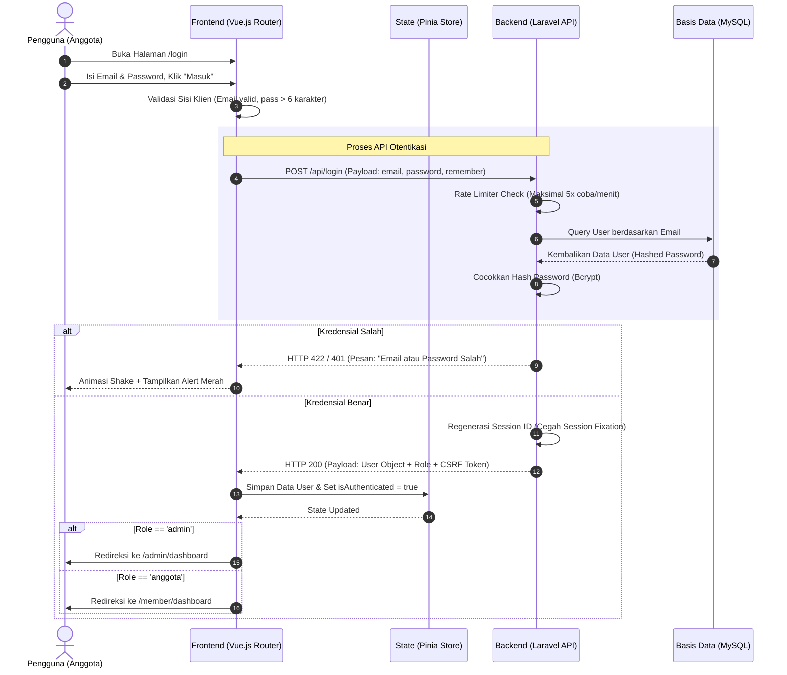

# Analisis Kebutuhan Fitur "Login Sebagai Anggota" 🧪🔑
### Sistem Otentikasi, Hak Akses (RBAC), dan Keamanan Proyek FORMULA

Ketika pengguna masuk ke aplikasi FORMULA, sistem harus membedakan dengan jelas apakah pengguna tersebut adalah **Admin** atau **Anggota (Member)** biasa. Fitur ini membutuhkan arsitektur otentikasi yang aman, *session state management* yang reaktif di frontend, serta proteksi route di backend maupun frontend.

Dokumen ini membedah seluruh kebutuhan fungsional, non-fungsional, alur data, serta implementasi teknis untuk fitur **Login sebagai Anggota**.

---

## 👥 1. Matriks Hak Akses & Otorisasi (RBAC)

Perbedaan hak akses antara **Pengunjung Umum (Guest)**, **Anggota (Member)**, dan **Admin** harus diatur secara ketat:

| Fitur / Halaman | Pengunjung Umum (Guest) | Anggota (Member) | Administrator (Admin) |
| :--- | :---: | :---: | :---: |
| **Landing Page** | 👁️ Lihat Teks & Gambar | 👁️ Lihat Teks & Gambar | 👁️ Lihat + ✏️ Edit CMS |
| **Profil Mandiri** | ❌ Tidak Ada Akses | 👁️ Lihat + ✏️ Edit Foto/Info | 👁️ Lihat + ✏️ Edit Foto/Info |
| **Data Kas Keuangan** | 👁️ Lihat Ringkasan Saldo | 👁️ Lihat Riwayat Detail | 👁️ Lihat + 🛠️ CRUD Transaksi |
| **Agenda & Rapat** | 👁️ Lihat Daftar Acara | 👁️ Detail Acara + Hasil Keputusan | 👁️ Lihat + 🛠️ CRUD Agenda |
| **Presensi Kegiatan** | ❌ Tidak Ada Akses | 🙋‍♂️ Kirim Izin/Sakit | 📝 Input Kehadiran Anggota |
| **Kelola Anggota** | ❌ Tidak Ada Akses | ❌ Tidak Ada Akses | 🛠️ CRUD Akun Anggota |
| **Dashboard Anggota** | ❌ Tidak Ada Akses | 👁️ Lihat Statistik Kehadiran | 👁️ Statistik Global Organisasi |

---

## 🔄 2. Alur Otentikasi Anggota (Authentication Flow)

Berikut adalah diagram alur logis dari proses login hingga pengalihan halaman dinamis berdasarkan peran (*role*):



---

## 🛠️ 3. Kebutuhan Fungsional Sisi Frontend (Vue.js)

### A. Proteksi Rute (Vue Router Navigation Guards)
Kita harus mencegah Anggota biasa membuka URL halaman admin (misal `/admin/members` atau `/admin/landing-config`) secara manual via *address bar*.

Implementasi navigation guard di `src/router/index.js` menggunakan properti `meta`:

```javascript
import { createRouter, createWebHistory } from 'vue-router'
import { useAuthStore } from '@/stores/auth'

const routes = [
  {
    path: '/member/dashboard',
    component: () => import('@/views/member/DashboardView.vue'),
    meta: { requiresAuth: true, role: 'anggota' }
  },
  {
    path: '/admin/members',
    component: () => import('@/views/admin/MembersView.vue'),
    meta: { requiresAuth: true, role: 'admin' }
  }
]

const router = createRouter({
  history: createWebHistory(),
  routes
})

router.beforeEach((to, from, next) => {
  const authStore = useAuthStore()
  const isAuthenticated = authStore.isAuthenticated
  const userRole = authStore.user?.role

  // 1. Periksa apakah halaman butuh login
  if (to.meta.requiresAuth && !isAuthenticated) {
    return next({ path: '/login', query: { redirect: to.fullPath } })
  }

  // 2. Periksa apakah role sesuai dengan tujuan halaman
  if (to.meta.role && to.meta.role !== userRole) {
    // Jika anggota mencoba masuk ke halaman admin, lempar ke dashboard anggota
    if (userRole === 'anggota') {
      return next('/member/dashboard')
    }
    // Jika admin mencoba masuk ke halaman khusus anggota, lempar ke dashboard admin
    if (userRole === 'admin') {
      return next('/admin/dashboard')
    }
  }

  next()
})

export default router
```

### B. Desain Halaman Login Premium (Visual & Interaktif)
Desain halaman login harus memikat pemuda Ngampon agar merasa bangga menggunakan aplikasi ini.
* **Glassmorphic Card**: Login box semi-transparan dengan background gradasi dinamis.
* **Show/Hide Password**: Tombol ikon mata di kolom password untuk memudahkan input.
* **Status Memuat (Loading State)**: Tombol "Masuk" berubah menjadi spinner saat request API sedang berjalan untuk mencegah klik ganda.
* **Fitur "Ingat Saya" (Remember Me)**: Cookie sesi bertahan lebih lama (cth: 30 hari) agar anggota tidak perlu login berulang kali setiap membuka browser.

---

## 🔒 4. Kebutuhan Non-Fungsional Sisi Backend (Laravel)

### A. Pencegahan Brute-Force (Rate Limiting)
Membatasi percobaan login dari alamat IP yang sama guna mencegah peretasan akun anggota.
* **Aturan**: Maksimal 5 kali percobaan login dalam 1 menit. Jika melebihi, IP akan diblokir dari route login selama 5 menit.
* **Laravel Implementation** (`RouteServiceProvider` atau `LoginRequest`):
  ```php
  RateLimiter::for('login', function (Request $request) {
      return Limit::perMinute(5)->by($request->ip());
  });
  ```

### B. Proteksi Sesi & Token Keamanan
* **Regenerasi Session ID**: Setelah login sukses, backend harus memanggil `$request->session()->regenerate()` untuk mencegah serangan *Session Fixation*.
* **CSRF Protection**: Setiap request POST/PUT/DELETE wajib menyertakan header `X-CSRF-TOKEN` untuk mencegah eksploitasi pihak ketiga.
* **Enkripsi**: Password wajib menggunakan hashing standar industri (`bcrypt` atau `argon2id`).

---

## 📊 5. Modul Halaman Dashboard khusus Anggota (Member Area)

Setelah anggota berhasil login, halaman dashboard mereka didesain khusus agar relevan dengan kebutuhan mereka sebagai anggota aktif:

### 1. Widget Statistik Pribadi (Personal Stats)
Menampilkan rangkuman kehadiran dan kontribusi kas mereka dalam 1 tahun terakhir:
* **Persentase Kehadiran**: Presentasi kehadiran dalam rapat (cth: `92% Kehadiran`).
* **Status Iuran Bulanan**: Status pembayaran kas terakhir (cth: `Lunas s/d Mei 2026`).

### 2. Form Permisi / Izin Mandiri (Dynamic RSVP Permission)
Jika anggota berhalangan hadir pada agenda rapat mendatang, mereka dapat mengirim konfirmasi "Izin" atau "Sakit" sebelum rapat dimulai:
* **Form**: Memilih agenda rapat, status (Izin/Sakit), dan alasan tidak hadir.
* **Dampak**: Data akan langsung masuk ke tabel `attendances` sehingga admin presensi tidak perlu menginputnya secara manual.

### 3. Portal Notulen Rapat & Keputusan Bersama
Anggota dapat membaca hasil kesepakatan rapat yang tertulis pada kolom `decisions` di tabel `activities` dalam format list interaktif.

---

> [!TIP]
> **Tahap Implementasi Selanjutnya:**
> Otentikasi berbasis sesi (Laravel Cookies & Session) adalah pilihan terbaik untuk integrasi Vue-Laravel satu domain karena secara otomatis terlindung dari serangan XSS (jika menggunakan cookie `HttpOnly`).
