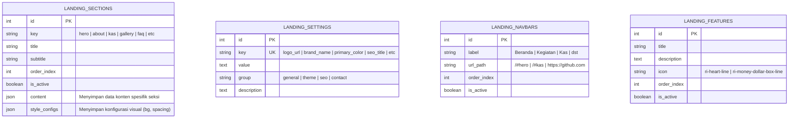

# Arsitektur Landing Page "Zero-Code" (CMS Dinamis Penuh) 🧪✨
### Panduan Implementasi Edit Tanpa Menyentuh Kode Program (FORMULA Page Builder)

Untuk mewujudkan landing page yang **100% dinamis**, di mana admin dapat mengubah teks, gambar, tata letak (*layout*), mengaktifkan/menonaktifkan bagian (*sections*), mengatur urutan tampilan (*ordering*), hingga mengganti warna tema utama (*branding colors*) tanpa menyentuh kode program sama sekali, kita memerlukan arsitektur **CMS Berbasis Komponen Dinamis** (*Dynamic Component Rendering*).

Dokumen ini menganalisis arsitektur lengkap, skema basis data, dan teknik integrasi antara **Laravel API** dan **Vue.js** untuk mencapai tujuan tersebut.

---

## 🏗️ 1. Konsep Utama: Sistem Render Dinamis (Dynamic Rendering System)

Alih-alih menaruh komponen HTML secara keras (*hardcoded*) di file Vue seperti ini:
```html
<!-- TIDAK DIREKOMENDASIKAN UNTUK ZERO-CODE -->
<HeroSection />
<SejarahSection />
<KasSection />
<GallerySection />
```

Kita menggunakan **Sistem Layout Dinamis** berbasis database. Vue.js akan membaca daftar seksi dari database dan merendernya menggunakan tag `<component :is="...">` bawaan Vue:

```html
<!-- DEREKOMENDASIKAN: Dinamis Berdasarkan Database -->
<template>
  <div :style="themeStyles">
    <component 
      v-for="section in activeSections" 
      :key="section.id" 
      :is="mapComponent(section.key)" 
      :content="section.content"
      :style-configs="section.style_configs"
    />
  </div>
</template>
```

Dengan metode ini, jika admin mengubah urutan seksi di dashboard, letak seksi di halaman depan akan langsung berpindah secara otomatis!

---

## 🗄️ 2. Skema Basis Data Pendukung "Zero-Code"

Untuk mendukung kendali penuh tanpa kode, kita memerlukan 4 tabel inti baru:



---

## ⚙️ 3. Detail Kolom Tabel & Konfigurasi JSON

### A. Tabel `landing_sections` (Pengatur Tata Letak & Konten Seksi)
Tabel ini adalah jantung dari landing page dinamis. Setiap baris mewakili satu blok/seksi di landing page.

* **Struktur Kolom**:
  | Kolom | Tipe Data | Keterangan |
  | :--- | :--- | :--- |
  | `id` | `bigint` (PK) | Auto-increment identifier |
  | `key` | `string` (Unique) | Pengenal seksi (cth: `'hero'`, `'about'`, `'kas_summary'`, `'testimonials'`) |
  | `title` | `string` | Judul seksi di admin panel |
  | `subtitle` | `string` | Subtitle seksi di admin panel |
  | `order_index`| `integer` | Indeks urutan tampilan (diurutkan secara `ASC` di query database) |
  | `is_active` | `boolean` | `true` jika seksi ingin ditampilkan, `false` jika ingin disembunyikan |
  | `content` | `json` | **SANGAT PENTING**: Data teks, gambar, dan tombol khusus untuk seksi tersebut. |
  | `style_configs`| `json` | Konfigurasi visual seksi (jarak atas-bawah, warna background khusus seksi). |

* **Contoh Data Baris `hero` (Kolom `content` berbentuk JSON)**:
  ```json
  {
    "title": "Membangun Pemuda Pemudi Ngampon",
    "subtitle": "Wadah kreativitas, kolaborasi, dan kemajuan sosial pemuda Ngampon.",
    "cta_text": "Gabung Anggota",
    "cta_link": "/register",
    "image_url": "/storage/landing/hero_bg.webp",
    "show_cta": true
  }
  ```

* **Contoh Data Baris `hero` (Kolom `style_configs` berbentuk JSON)**:
  ```json
  {
    "background_type": "glassmorphic",
    "padding_top": "120px",
    "padding_bottom": "120px",
    "title_color": "#ffffff",
    "is_dark_mode": true
  }
  ```

---

### B. Tabel `landing_settings` (Variabel Global & Branding)
Tabel ini menyimpan konfigurasi global untuk seluruh situs. Struktur *Key-Value* mempermudah penambahan pengaturan baru di masa mendatang tanpa mengubah struktur tabel database.

* **Struktur Kolom**:
  | Kolom | Tipe Data | Keterangan |
  | :--- | :--- | :--- |
  | `id` | `bigint` (PK) | Auto-increment |
  | `key` | `string` (Unique) | Nama pengaturan (cth: `'logo_url'`, `'primary_color'`) |
  | `value` | `text` | Nilai pengaturan (bisa berupa teks, hex warna, atau path gambar) |
  | `group` | `string` | Pengelompokan di admin (cth: `'branding'`, `'seo'`, `'notifikasi'`) |
  | `description`| `text` | Panduan untuk admin di dashboard |

* **Contoh Kumpulan Data `landing_settings`**:
  | key | value | group | description |
  | :--- | :--- | :--- | :--- |
  | `brand_name` | `FORMULA` | `branding` | Nama brand/organisasi di navbar & footer |
  | `logo_url` | `/storage/branding/logo.png` | `branding` | Logo utama yang tampil di pojok kiri atas |
  | `primary_color` | `#6366f1` (Indigo) | `theme` | Warna primer utama untuk tombol dan hover |
  | `secondary_color` | `#4f46e5` | `theme` | Warna sekunder untuk gradasi |
  | `glass_blur` | `16px` | `theme` | Intensitas blur untuk efek glassmorphism |
  | `seo_title` | `FORMULA - Forum Pemuda Ngampon` | `seo` | Judul tab browser (SEO) |
  | `seo_desc` | `Portal resmi organisasi kepemudaan Ngampon` | `seo` | Deskripsi pencarian Google |
  | `email_notification`| `admin@formula.org` | `notifikasi` | Email penerima form Hubungi Kami |

---

## 🛠️ 4. File Migrasi Laravel Lengkap

Buat file migrasi baru bernama `database/migrations/xxxx_xx_xx_create_zero_code_landing_page_tables.php` dan masukkan blueprint database berikut:

```php
<?php

use Illuminate\Database\Migrations\Migration;
use Illuminate\Database\Schema\Blueprint;
use Illuminate\Support\Facades\Schema;

return new class extends Migration
{
    public function up(): void
    {
        // 1. Tabel Seksi Landing Page (Layout & Konten Seksi)
        Schema::create('landing_sections', function (Blueprint $table) {
            $table->id();
            $table->string('key')->unique(); // hero, about, gallery, kas, faq, contact
            $table->string('title');
            $table->string('subtitle')->nullable();
            $table->integer('order_index')->default(0);
            $table->boolean('is_active')->default(true);
            $table->json('content')->nullable(); // menyimpan detail text, image, link
            $table->json('style_configs')->nullable(); // menyimpan padding, background, dll
            $table->timestamps();
        });

        // 2. Tabel Pengaturan Sistem Global (Key-Value)
        Schema::create('landing_settings', function (Blueprint $table) {
            $table->id();
            $table->string('key')->unique();
            $table->text('value')->nullable();
            $table->string('group')->default('general'); // branding, theme, seo, config
            $table->text('description')->nullable();
            $table->timestamps();
        });

        // 3. Tabel Link Navigasi (Menu Manager Dinamis)
        Schema::create('landing_navbars', function (Blueprint $table) {
            $table->id();
            $table->string('label');
            $table->string('url_path'); // cth: /#hero atau /agenda
            $table->integer('order_index')->default(0);
            $table->boolean('is_active')->default(true);
            $table->timestamps();
        });

        // 4. Tabel Fitur Keunggulan (Dynamic Grid Icons)
        Schema::create('landing_features', function (Blueprint $table) {
            $table->id();
            $table->string('title');
            $table->text('description');
            $table->string('icon')->default('ri-star-line'); // class remix icon
            $table->integer('order_index')->default(0);
            $table->boolean('is_active')->default(true);
            $table->timestamps();
        });
    }

    public function down(): void
    {
        Schema::dropIfExists('landing_features');
        Schema::dropIfExists('landing_navbars');
        Schema::dropIfExists('landing_settings');
        Schema::dropIfExists('landing_sections');
    }
};
```

---

## 🎨 5. Dynamic Theme Engine (Mengubah Warna & Visual dari Database)

Bagaimana cara Vue.js memproses kode warna `#6366f1` dari database menjadi tampilan website secara instan? Kita menggunakan **CSS Variables** (`var(--nama-variabel)`) di CSS global kita.

### Langkah A: Buat CSS Global Menggunakan Variabel
Dalam file `index.css` atau file styling utama Anda, definisikan variabel dasar pada `:root`:

```css
:root {
  /* Default Values (Akan dioverwrite secara dinamis oleh Vue) */
  --primary-color: #6366f1;
  --secondary-color: #4f46e5;
  --glass-blur: 16px;
  --glass-bg-opacity: 0.1;
  --font-family: 'Inter', sans-serif;
}

/* Gunakan variabel tersebut pada elemen styling */
.btn-primary {
  background-color: var(--primary-color);
  border-color: var(--primary-color);
  transition: all 0.3s ease;
}
.btn-primary:hover {
  background-color: var(--secondary-color);
  transform: translateY(-2px);
}
.glass-card {
  background: rgba(255, 255, 255, var(--glass-bg-opacity));
  backdrop-filter: blur(var(--glass-blur));
  -webkit-backdrop-filter: blur(var(--glass-blur));
  border: 1px solid rgba(255, 255, 255, 0.2);
}
```

### Langkah B: Inject Nilai Database dari Pinia / Vue State ke CSS Root
Ketika aplikasi Vue pertama kali mendownload data dari backend API `/api/landing/settings`, kita menimpa nilai CSS variables di dokumen HTML secara dinamis:

```javascript
// Di dalam Pinia Store atau App.vue Anda
actions: {
  applyDynamicTheme(settings) {
    const root = document.documentElement;

    // Cari value warna dan blur dari response API settings
    const primary = settings.find(s => s.key === 'primary_color')?.value || '#6366f1';
    const secondary = settings.find(s => s.key === 'secondary_color')?.value || '#4f46e5';
    const blur = settings.find(s => s.key === 'glass_blur')?.value || '16px';
    const font = settings.find(s => s.key === 'font_family')?.value || 'Outfit';

    // Terapkan langsung ke elemen DOM teratas (:root)
    root.style.setProperty('--primary-color', primary);
    root.style.setProperty('--secondary-color', secondary);
    root.style.setProperty('--glass-blur', blur);
    
    // Opsional: Load Font Keluarga Google Fonts secara dinamis
    if (font) {
      root.style.setProperty('--font-family', `'${font}', sans-serif`);
      const link = document.createElement('link');
      link.rel = 'stylesheet';
      link.href = `https://fonts.googleapis.com/css2?family=${font.replace(' ', '+')}:wght@300;400;600;700&display=swap`;
      document.head.appendChild(link);
    }
  }
}
```

---

## 🖥️ 6. Rancangan Antarmuka Dashboard Admin (CMS Control)

Untuk membuat sistem ini beroperasi sepenuhnya tanpa menyentuh kode, buat halaman **Dashboard > Pengaturan Landing Page** di Vue.js dengan 4 tab panel utama:

```
+-----------------------------------------------------------------------------+
|  [DASHBOARD CMS FORMULA]                                                   |
+-----------------------------------------------------------------------------+
|  [⚙️ Umum]   [🎨 Desain/Tema]   [🧩 Seksi Halaman]   [🔗 Menu Navigasi]       |
+-----------------------------------------------------------------------------+
|                                                                             |
|  * KELOLA SEKSI HALAMAN (Drag & Drop Urutan)                                 |
|  +-----------------------------------------------------------------------+  |
|  | [=] 1. Hero Section      [Aktif/Nonaktif] [✏️ Edit Konten] [🎨 Gaya]  |  |
|  | [=] 2. Tentang & Sejarah [Aktif/Nonaktif] [✏️ Edit Konten] [🎨 Gaya]  |  |
|  | [=] 3. Transparansi Kas  [Aktif/Nonaktif] [✏️ Edit Konten] [🎨 Gaya]  |  |
|  | [=] 4. Galeri Foto       [Aktif/Nonaktif] [✏️ Edit Konten] [🎨 Gaya]  |  |
|  | [=] 5. FAQ (Tanya Jawab) [Aktif/Nonaktif] [✏️ Edit Konten] [🎨 Gaya]  |  |
|  +-----------------------------------------------------------------------+  |
|  [Simpan Urutan & Status]                                                   |
|                                                                             |
|  * FORM EDIT SEKSI (Contoh: Hero Section)                                   |
|  +-----------------------------------------------------------------------+  |
|  | Judul Utama:  [ Membangun Pemuda Ngampon Unggul             ]          |  |
|  | Subtitle:     [ Wadah kolaborasi untuk masa depan karang taruna ]          |  |
|  | Teks Tombol:  [ Gabung Sekarang ]  Link Tombol: [ /join        ]          |  |
|  | Gambar Background: [ Piliih Gambar (Upload via API Storage)  ]          |  |
|  +-----------------------------------------------------------------------+  |
|                                                                             |
+-----------------------------------------------------------------------------+
```

---

## 🚀 Langkah Eksekusi Praktis (Langkah Demi Langkah)

1. **Jalankan Migrasi Database**:
   Salin blueprint migrasi di bagian **Poin 4** ke dalam backend Laravel Anda, lalu jalankan `php artisan migrate`.

2. **Buat Landing Seeder**:
   Buat data awal (*seed*) di Laravel agar landing page langsung terisi default konten saat pertama kali di-*migrate* agar halaman depan tidak kosong.

3. **Buat Controller di Laravel (`LandingCMSController`)**:
   * `GET /api/landing/all`: Mengambil layout seksi aktif, navigasi aktif, dan variabel desain.
   * `POST /api/admin/landing/settings`: Mengubah isi setting global.
   * `POST /api/admin/landing/sections/{id}`: Mengubah status aktif, urutan, atau isi JSON `content` dari seksi tertentu.

4. **Koneksikan dengan Vue.js**:
   Di Vue.js, buat loop komponen dinamis dan gunakan CSS Variables di `:root` untuk mengaplikasikan warna dan font langsung dari respons API database.

---

> [!IMPORTANT]
> **Mengapa Pendekatan Ini Terbaik?**
> Pendekatan ini membuat web aplikasi **FORMULA** sangat fleksibel dan berskala *Enterprise*. Anda tidak perlu mengulang proses *deploy* atau mengubah baris kode di server Laragon/Hosting untuk sekadar mengganti warna tema, menyembunyikan seksi sementara, atau mengupload logo baru.
